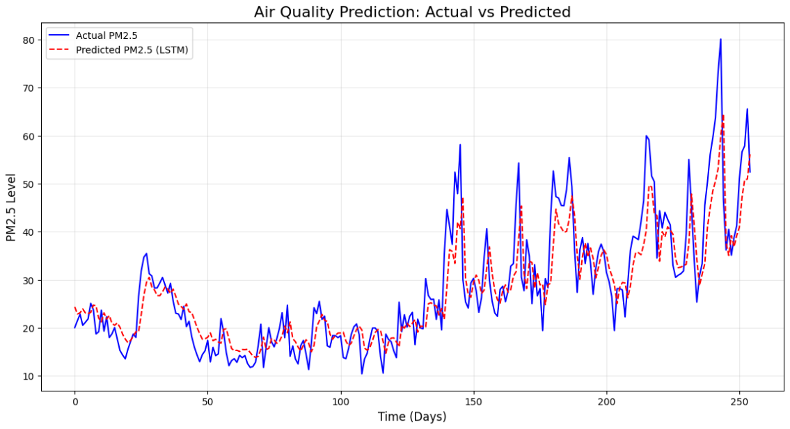
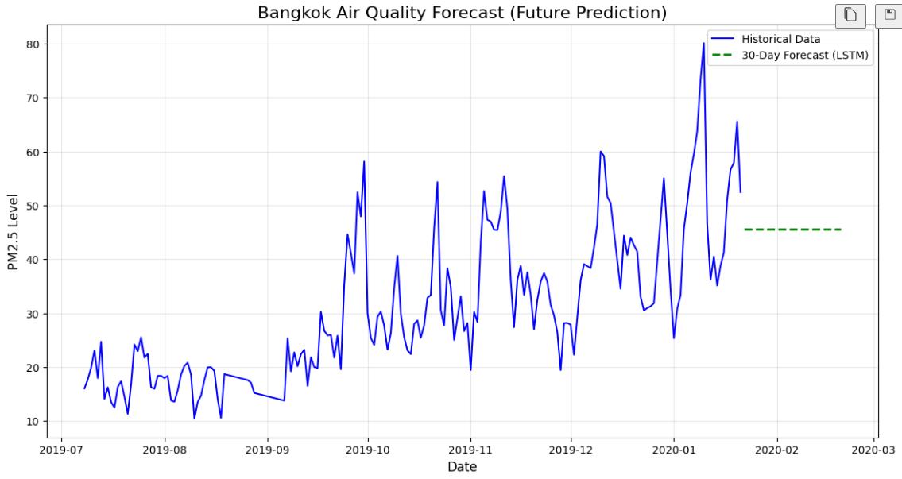

Air Quality Forecasting in Thailand using LSTM

📖 Overview
Air pollution is a critical environmental issue in Thailand, particularly during the "Smog Season" (December–April). This project utilizes Long Short-Term Memory (LSTM) networks—a type of Recurrent Neural Network (RNN)—to forecast PM2.5 levels based on historical air quality data.

By accurately predicting pollution levels, this model aims to assist city planners and the public in making data-driven decisions regarding health and outdoor activities.

📊 Dataset
The project uses historical air quality data collected in Samut Prakan, Thailand.

Source: Berkeley Earth / Pollution Control Department (PCD) Thailand
Time Period: March 2016 – January 2020
Features: Year, Month, Day, UTC Hour, PM2.5 Concentration
Frequency: Hourly (Resampled to Daily Average for modeling)
🛠️ Methodology
The project follows a structured Data Science pipeline:

Data Preprocessing:
Cleaning raw data (handling missing values and metadata).
Resampling hourly data to daily averages to identify clearer seasonal trends.
Scaling data using MinMaxScaler for LSTM compatibility.
Exploratory Data Analysis (EDA):
Visualizing PM2.5 trends over time to identify "Burning Season" spikes.
Model Development:
Constructing a Sequential LSTM model with two LSTM layers and Dropout regularization to prevent overfitting.
Training on 80% of the data, testing on 20%.
Forecasting:
Generating a 30-day future forecast based on the trained model.
🤖 Tech Stack
Language: Python
Libraries:
Pandas (Data Manipulation)
NumPy (Numerical Computing)
Matplotlib (Data Visualization)
TensorFlow / Keras (Deep Learning Model)
🚀 How to Run
To reproduce this project:

Clone the repository:
git clone (https://github.com/heinhtoonaing/Air-Quality-Forecasting-LSTM.git)
Install dependencies:Ensure you have Python installed, then install the required libraries:
pip install numpy pandas matplotlib tensorflow scikit-learn
Run the Notebook:
Open AirQualityPrediction.ipynb in Jupyter Notebook or Google Colab.
Execute the cells sequentially to load data, train the model, and view predictions.
📈 Results
The LSTM model was trained for 25 epochs. It successfully learned the seasonal patterns of PM2.5 levels.

Training Loss: Reduced significantly, indicating the model captured the underlying data structure.
Prediction Accuracy: The model closely follows actual test data trends.
Future Forecast: The 30-day projection helps anticipate upcoming pollution spikes.
Actual vs Predicted Graph

Future Forecast Graph

